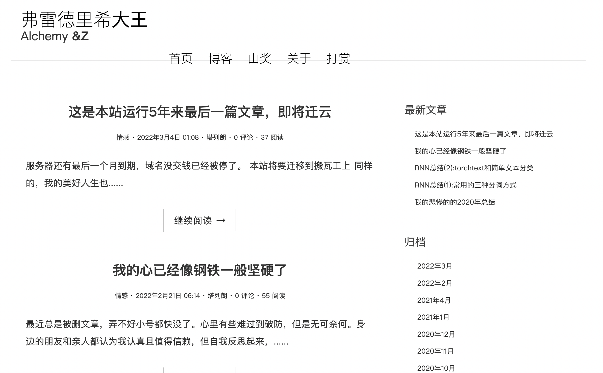

# 个人博客的源代码   
## 概述
组织结构是大概几年以前写的     

现在托管在https://yuchen.pythonanywhere.com/

新版已经上线了

在线上版中因为偷懒懒得写前端的验证码所以注释了评论区的代码   
编辑方式是在django admin中写markdown，   
确实也足够偷懒的.....   
内部有一个知乎想法抽奖的爬虫前端页面，是第二个白屏的知乎抽奖爬虫   

## 使用方法
1. 安装依赖
2. 建库建表
3. 部署文档请参考https://yuchen.pythonanywhere.com/post/184/
## 后续改进 

##   

因为界面太丑，再加上在后端写markdown让人失落   
于是彻底重写了所有逻辑  
新版博客重新使用flask写了前后端，加入了富文本编辑器
